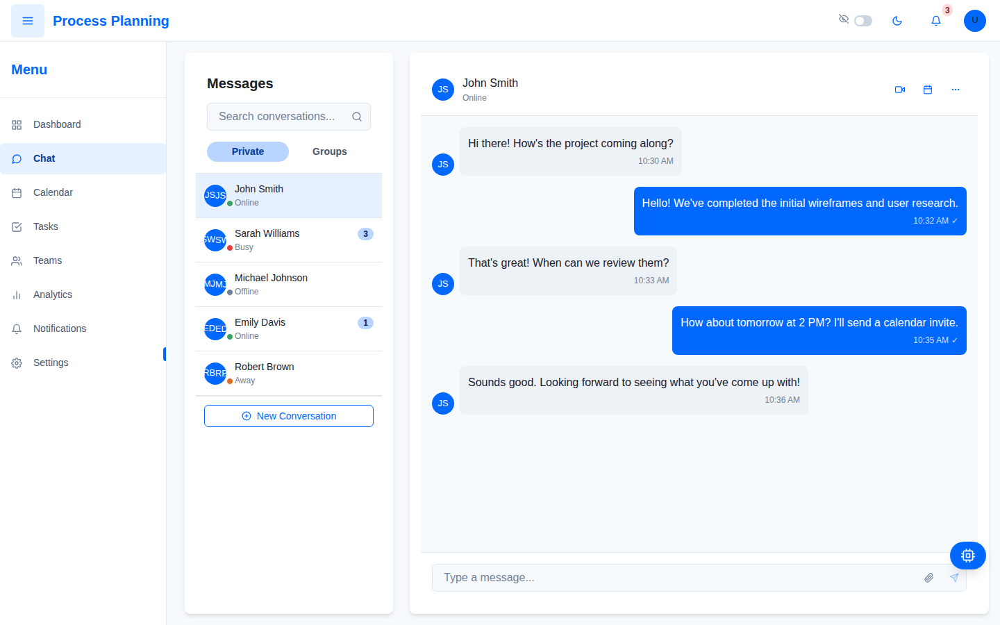

# HCI Dashboard - Frontend MVP

This project is a frontend-only MVP (Minimum Viable Product) for an HCI Dashboard application. It features interactive mockups and UI components without implementing a persistent data layer or real-time updates.



## Key Features

- **Static Data Dashboards**
  - Pending Work Tracker (Pie Chart)
  - Performance Improvement Analysis (Line Chart)
  - Completed Work Overview (Stacked Bar Chart)
  - Notifications Dashboard (Donut Chart)
  - Workload Heatmap (Visual Grid)
  - Project Success/Failure Comparison (Comparative Bar Chart)

- **Interactive Chat System (UI Only)**
  - Chat UI Layout with sample messages
  - Private vs. Group Tabs
  - Message Input Field (visual only)
  - Tagged Notifications
  - Meeting Scheduling & Room Allocation (Mock)

- **Navigation & Layout**
  - Sidebar navigation
  - Responsive design for desktop, tablet, and mobile
  - Dark Mode Toggle

- **Accessibility Considerations**
  - Proper color contrasts
  - Scalable fonts
  - Keyboard navigability

## Getting Started

### Prerequisites

- Node.js
- npm or yarn

### Installation

1. Clone the repository
2. Install dependencies:
   ```
   cd temp
   npm install
   ```

3. Run the development server:
   ```
   npm run dev
   ```

## Tech Stack

- React
- TypeScript
- Vite
- Chart.js with react-chartjs-2
- React Router

## Project Structure

```
/src
  /components
    /dashboard  - Chart components
    /chat       - Chat UI components
    /navigation - Header and sidebar
    /common     - Shared components
  /pages        - Main application pages
  /theme        - Theme configuration
  /utils        - Helper functions
```

## Purpose

This MVP demonstrates:
- Look & Feel Validation
- Usability Testing
- Initial Design Iterations

All data is static demonstration data for presentation purposes only.